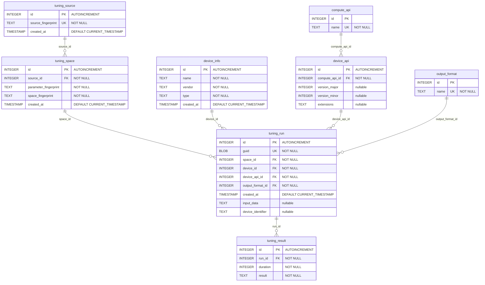

# Database ERD

Entity-relationship diagram of the SQLite schema created by `Schema::CreateIfNotExists`
(see [Database/Schema/Schema.cpp](Database/Schema/Schema.cpp)).

## Notes

- `compute_api` and `output_format` are seeded lookup tables:
  - `compute_api`: `OpenCL` (1), `CUDA` (2), `Vulkan` (3), `Cpp` (4)
  - `output_format`: `JSON` (1), `JSON_T4` (2), `XML` (3)
- Unique constraints (beyond the marked `UK` columns):
  - `device_info` — unique on `(name, vendor, type)`
  - `device_api` — unique on `(compute_api_id, version_major, version_minor, extensions)`
  - `tuning_space` — unique on `(space_fingerprint, parameter_fingerprint, source_id)`
- A `tuning_run` is uniquely identified across databases by its `guid`, which is what
  `SyncFromFile` uses to skip already-imported runs.
- `tuning_run.device_identifier` is the persistent hardware identifier of the device the run executed on
  (the device UUID reported by the compute API, e.g. `GPU-<uuid>` for CUDA). It originates from
  `ktt::DeviceInfo::GetDeviceIdentifier()` and is carried through `ktt::db::DeviceInfo::deviceIdentifier`. It is
  nullable: the C++/CPU backend and devices whose driver does not expose a UUID leave it `NULL`. It is preserved
  across databases by `SyncFromFile`.
